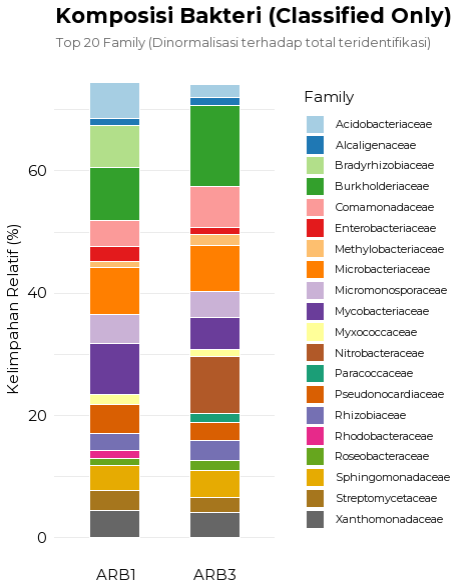

# Metagenomic-Taxonomy-Visualization
R script to visualize Kraken2 metagenomic data using Stacked Barplot and Dumbbell Plot

This repository contains R scripts for visualizing taxonomic analysis results (Kraken2/Bracken) from metagenomic samples.

## Features
* **Data Cleaning:** Removal of "unclassified" reads.
* **Re-normalization:** Re-calculation of relative abundances based on classified reads only.
* **Stacked Barplot Visualization:** Visualizes Community Composition across samples.
* **Dumbbell Plot Visualization:** Compares Specific Abundance changes between groups or conditions.

## Visualization Result


## Requirements
To run the script, ensure you have R installed along with the following packages:
* `tidyverse`
* `scales`
* `ggalt` (if used for dumbbell plots)

Run this in R to install them:
```r
install.packages(c("tidyverse", "scales", "ggalt"))
